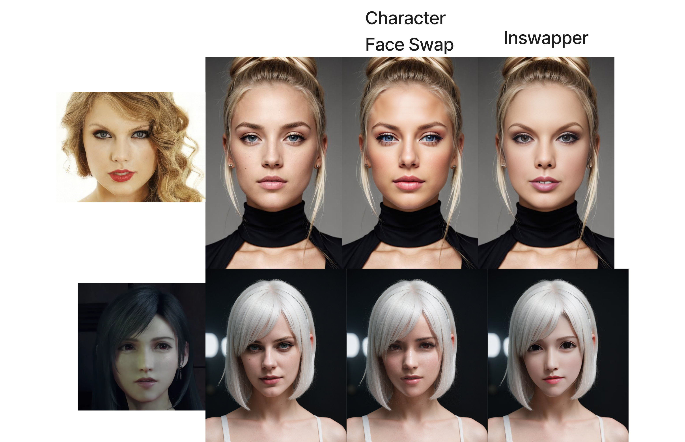

# CharacterFaceSwap

## Overview

Welcome to the Character Face Swap workflow! It is specialized for your target character face swap. Use LoRA and embeddings to enhance character concept in stable diffusion. Whether you're a fan of video games, anime, or photorealistic, swap face with your favorite characters in a realistic and seamless manner.



## Installation

### ControlNet

ControlNet ip2p model is used for visual conditioning, download [ip2p](https://huggingface.co/lllyasviel/ControlNet-v1-1/blob/main/control_v11e_sd15_ip2p.pth) and put it in `ComfyUI/models/controlnet`

### Character Face Swap

Recommend using [ComfyUI Manager](https://github.com/ltdrdata/ComfyUI-Manager).
Search Character Face Swap in manager and install. 
In your ComfyUI, load workflows in `custom_nodes/CharacterFaceSwap/workflows`.


For manual installation,

```bash
cd ComfyUI/custom_nodes/
git clone https://github.com/ArtBot2023/CharacterFaceSwap.git
cd CharacterFaceSwap
# if you use ported ComfyUI
../../../python_embeded/python install.py
# otherwise
python install.py
```

In your ComfyUI, load workflows in `custom_nodes/CharacterFaceSwap/workflows`.


## How It Works

<details>
  <summary>Choose Checkpoint and LoRA trained for your character.</summary>
  
</details>

<details>
  <summary>Upload Base Image and Character Face</summary>
  
</details>


<details>
  <summary>Write prompts to describe target face, use LoRA keywords and embeddings.</summary>
  
</details>

<details>
  <summary>
  Generate character face, you can check character face generation in Preview. Download Face with Seam, and Seam Mask.
  </summary>
  
  
</details>

<details>
  <summary>
  Seam Fix Inpainting: Use webui inpainting to fix seam. Check [FAQ](#faq)
  </summary>
  
</details>

<details>
  <summary>
  Upload Seamless Face: Upload inpainting result to Seamless Face, and Queue Prompt again. Done!
  </summary>
    
</details>

## FAQ

**Q**: Why not use ComfyUI for inpainting?

**A**: ComfyUI currently have issue about inpainting models, see [issue](https://github.com/comfyanonymous/ComfyUI/issues/1186) for detail. If anyone find a solution, please notify me.
